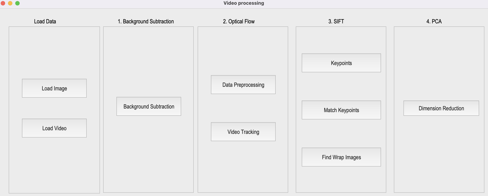
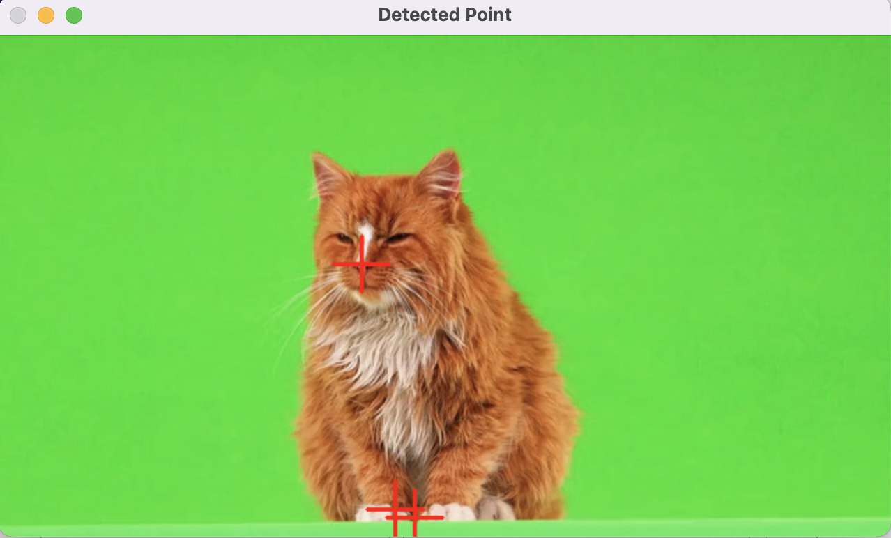
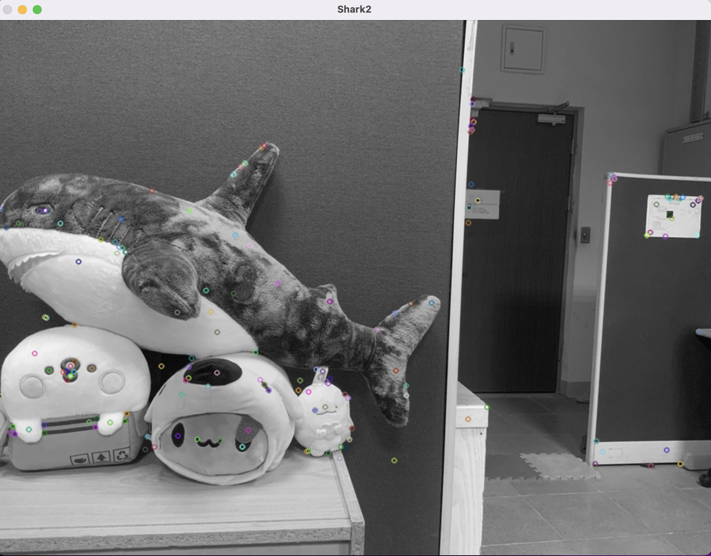
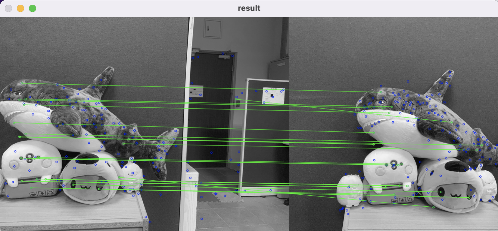

# OpenCV-Computer-Vision Practice fourth

*Discription:*

***1.This project aims to practice various techniques in computer vision using OpenCV library to analyze and process video data. It encompasses implementing algorithms for tasks such as background subtraction, optical flow tracking, SIFT (Scale-Invariant Feature Transform), and PCA (Principal Component Analysis) for feature extraction and motion analysis.***

***2.The focus of this project focus on understanding and implementing computer vision algorithms to extract information from video :***
  * Background subtraction: This method is used to separate foreground objects from the background in a video sequence, enabling the detection of moving objects.
  * Optical flow tracking: It involves estimating the motion of objects in a video sequence by analyzing the displacement of pixels between consecutive frames. This technique is valuable for tracking object trajectories and understanding motion patterns.
  * SIFT (Scale-Invariant Feature Transform): SIFT is a feature detection algorithm used to identify distinctive key points in an image regardless of scale, rotation, or illumination changes. It's widely used in object recognition, image stitching, and 3D reconstruction tasks.
  * PCA (Principal Component Analysis): PCA is a statistical method used for dimensionality reduction by transforming the data into a lower-dimensional space while preserving the most important information. In the context of computer vision, PCA can be applied for feature extraction and pattern recognition tasks.***

**1.Requirements and dependencies**
  * Python 3.7 (https://www.python.org/downloads/)
  * Opencv-contrib-python (3.4.2.17)
  * Matplotlib 3.1.1
  * UI framework: pyqt5 (5.15.1)

**2.Usage:**

1. Downloads whole repository and change path into the main folder
2. Run `python start.py` .
3. Input the image 1 for feature 1 and image 2 for feature 2.
4. Run the whole code.

**3.Feature:**

1.Background Substraction

* 1.1 Background Substraction :
  
    * Convert video frames to Gray (cv2.cvtColor).
    * For every pixels in video from 0~24 frames, build a gaussian model with mean and standard deviation (if standard deviation is less then 5, set to 5).
    * For frame > 24, test every frame pixels with respective gaussian model. If gray value difference between testing pixel and gaussian mean is larger than 5 times standard deviation, set testing pixel to 255 (foreground, white), 0 (background, black) otherwise.
    * Remove background (cv2.bitwise_and)

https://github.com/Kung-hen/Background-removal-Optical-Flow-SIFT-PCA-/assets/95673520/5d9195bd-b5a8-4541-b375-59088ed5d04b

1.Optical Flow

* 2.1 Data Preprocessing :
    * Use Opencv function `cv2.goodFeaturesToTrack` to detect corner automatically.
    * Detect the [cute cat video.mp4](Cat.mp4) nose circles and display 1 image (First Frame only).
    * With them marked with a square bounding box and cross mark.
       

* 2.2 Feature tracking : 
  
    * Track the point (detected in 2.1) on the whole video using OpenCV function `cv2.calcOpticalFlowPyrLK`.
    * Display the trajectory of the tracking point throughout the video using cv2.line. 

https://github.com/Kung-hen/Background-removal-Optical-Flow-SIFT-PCA-/assets/95673520/4081b1ee-4563-4fe6-97cb-078c4a05c204
    
3.SIFT

* 3.1 Keypoints
   * Load image 1 [Shark1.jpg](main/Figures/Q3_Image/Shark1.jpg)  
   * Based on SIFT algorithm, find  keypoints on traffics.png.
   * Use OpenCV SIFT detector to detect keypoints and descriptors.
   * Use `sift = cv.SIFT_create()` create a SIFT detector,`sift.detectAndCompute(image,None)`
   * Then use `cv2.drawMatchesKnn ` save and draw the keypoints.

* 3.2 Match Keypoints :
   * Load Image 1 [Shark1.jpg](main/Figures/Q3_Image/Shark1.jpg) and Image 2 [Shark2.jpg](main/Figures/Q3_Image/Shark2.jpg)
   * Based on SIFT algorithm, find the keypoints and descriptors at Image 1 and Image 2 (same as question 3.1) and match the most related between descriptors 1 and descriptors 2.
   * Use OpencCV `DescriptorMatcher.knnMatch(descriptors 1, descriptors 2)` to locate the matched keypoints.
   * Save and draw the matched feature points between two image.
          

* 3.3 Find Wrap Images
       

